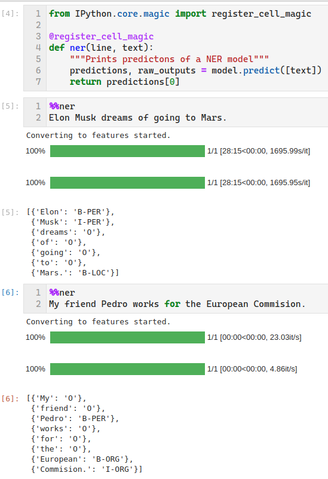
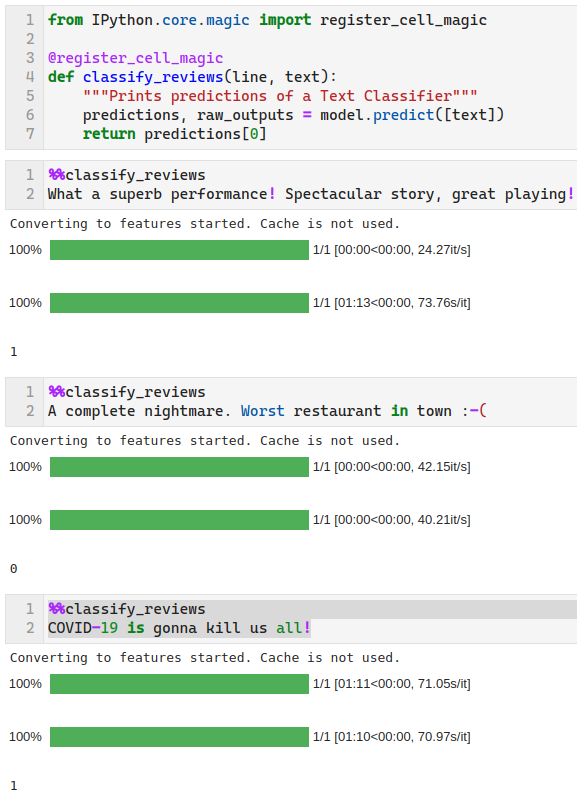
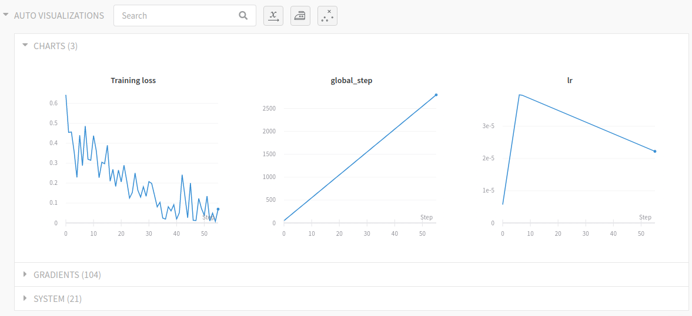

# Casos prácticos de NLP en el Máster de Kschool

Este fin de semana he vuelto a dar clase en el [Máster de Inteligencia Artificial y *Deep Learning* de Kschool](https://kschool.com/cursos/master-deep-learning-inteligencia-artificial-madrid/) para las sesiones de casos prácticos de procesamiento del lenguaje natural.



Hubo tiempo para hacer muchas cosas todo: 

- juguetear con modelos ya pre-entrenados para extraer tripletas de relaciones
  en tweets y noticias,

- hacer *fine tuning* de BERT, DistilBERT y RoBERTa con colecciones de datos públicas,

- trackear experimentos y compartir resultados en [Weights & Biases](https://www.wandb.com/), 

- y cerrar el módulo de NLP haciendo aplicaciones sencillitas con [Streamlit](https://www.streamlit.io/).

